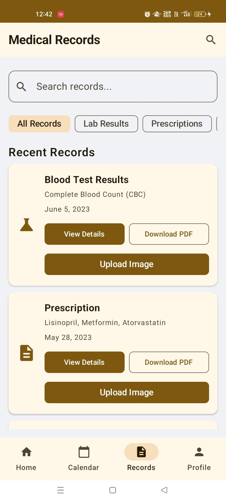

# HealthcareApp - Comprehensive Health Management System


*A sleek, custom splash screen with gradient background and circular design elements.*

---

## 🩺 Description

**HealthcareApp** is a modern, feature-rich Android application designed to help users manage their health effortlessly — from appointments and prescriptions to medical records and reminders.

Developed using **Kotlin** and **Jetpack Compose**, and integrated with **Firebase**, this project demonstrates clean architecture, intuitive design, and real-time cloud functionality for a seamless user experience.

---

## 🚀 Features

- **🔆 Custom Splash Screen:** Elegant startup screen with gradient and curved elements.
- **🔐 Firebase Authentication:** Secure login and signup with email/password.
- **👤 Dynamic User Profiles:** Real-time cloud sync of user data using Firestore.
- **🧭 Smooth Navigation:** Bottom navigation with transitions across Home, Calendar, Records, and Profile.
- **🏠 Home Dashboard:**
  - Personalized greetings.
  - Health summary cards (Activity, Sleep, Nutrition).
  - Quick access to appointments, prescriptions, and hospitals (placeholder).
- **📅 Appointment Management:**
  - View and add appointments with calendar integration.
  - Modify appointment status (Confirm, Reschedule, Cancel).
- **💊 Medication Reminders:**
  - "Take Now" action triggering local notifications.
- **📄 Medical Records Manager:**
  - View, search, and filter records.
  - Upload images (lab results/X-rays) to Firebase Storage (placeholder).
- **👨‍⚕️ Mock Video Call:** Demonstrates a patient-doctor video call interface.
- **🔔 Local Notifications:** For reminders and image uploads with Android 13+ permission handling.
- **⚙️ Profile & Settings:**
  - View/edit medical and insurance info.
  - App notification settings & dark mode toggle (UI only).
  - Logout with confirmation.

---

## 🔧 Technologies Used

| Category       | Tools/Frameworks                              |
|----------------|-----------------------------------------------|
| Language       | Kotlin                                         |
| UI Toolkit     | Jetpack Compose + Material Design 3            |
| Navigation     | Jetpack Navigation Component                   |
| State Handling | `mutableStateOf`, `remember`, `LaunchedEffect` |
| Backend        | Firebase (Auth & Firestore)                    |
| Permissions    | AndroidX Activity Result API                   |
| Date/Time      | `java.time.*` API                              |
| Notifications  |  Android local notifications                   |   

---

## 🖼️ Screenshots

> Replace `image.png` with actual screenshots

### Splash Screen


### Authentication


### Home Dashboard


### Appointments


### Medical Records



### Profile Management


### Others


---
## How to Run the Project

To get a local copy up and running, follow these simple steps.

1.  **Clone the repository:**
    ```bash
    git clone [https://github.com/YOUR_USERNAME/HealthApp.git](https://github.com/YOUR_USERNAME/HealthApp.git)
    ```
2.  **Open in Android Studio:**
    * Launch Android Studio.
    * Select "Open an existing Android Studio project".
    * Navigate to the cloned `HealthApp` directory and open it.
3.  **Firebase Setup:**
    * Go to [Firebase Console](https://console.firebase.google.com/) and create a new Firebase project.
    * Inside your Firebase project, add an Android app.
    * **Crucially**, register your app with the exact `Android package name` used in your project: `com.example.healthapp`.
    * Provide your `debug signing certificate SHA-1` fingerprint. You can obtain this by opening the `Gradle` tab in Android Studio (usually on the right side), navigating to `app` > `Tasks` > `android` > `signingReport`, and copying the SHA-1 from the console output.
    * Download the `google-services.json` file provided by Firebase.
    * Place this `google-services.json` file directly into your `app/` directory (e.g., `HealthApp/app/google-services.json`).
    * In Firebase Console, navigate to `Build` > `Authentication` > `Sign-in method` and ensure `Email/Password` provider is **Enabled**.
    * Optionally, in `Authentication` > `Users`, click `Add user` to create a test account (e.g., email: `test@example.com`, password: `password`).
    * In `Build` > `Firestore Database` > `Rules`, ensure your rules allow authenticated users to read and write data (e.g., `allow read, write: if request.auth != null;` for testing, but secure them for production).
4.  **Update `build.gradle.kts`:**
    * Ensure your project-level `build.gradle.kts` (`HealthApp/build.gradle.kts`) includes:
        ```kotlin
        plugins {
            // ...
            id("com.google.gms.google-services") version "4.4.2" apply false
        }
        ```
    * Ensure your module-level `build.gradle.kts` (`HealthApp/app/build.gradle.kts`) includes:
        ```kotlin
        plugins {
            // ...
            id("com.google.gms.google-services")
        }
        android {
            defaultConfig {
                // ...
                minSdk = 26 // Ensure this is 26 or higher for java.time API
            }
            // ...
        }
        dependencies {
            // ...
            implementation(platform("com.google.firebase:firebase-bom:33.1.1"))
            implementation("com.google.firebase:firebase-auth-ktx")
            implementation("com.google.firebase:firebase-firestore-ktx")
        }
        ```
5.  **Update `AndroidManifest.xml`:**
    * Add the notification permission inside the `<manifest>` tag, outside `<application>`:
        ```xml
        <uses-permission android:name="android.permission.POST_NOTIFICATIONS"/>
        ```
6.  **Sync Gradle:**
    * In Android Studio, click `File` > `Sync Project with Gradle Files` (or the elephant icon in the toolbar).
7.  **Run the App:**
    * Connect an Android device or start an emulator.
    * Click the green "Run" button in Android Studio.
    * The app should launch with the splash screen, followed by the login/signup screen.

## Contributing

Contributions are welcome! If you have suggestions for improvements or new features, please feel free to:
1.  Fork the repository.
2.  Create your feature branch (`git checkout -b feature/AmazingFeature`).
3.  Commit your changes (`git commit -m 'Add some AmazingFeature'`).
4.  Push to the branch (`git push origin feature/AmazingFeature`).
5.  Open a Pull Request.

